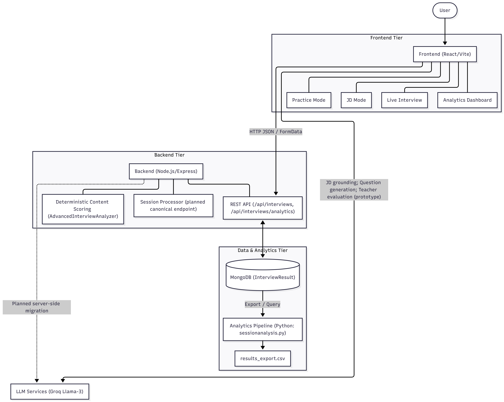
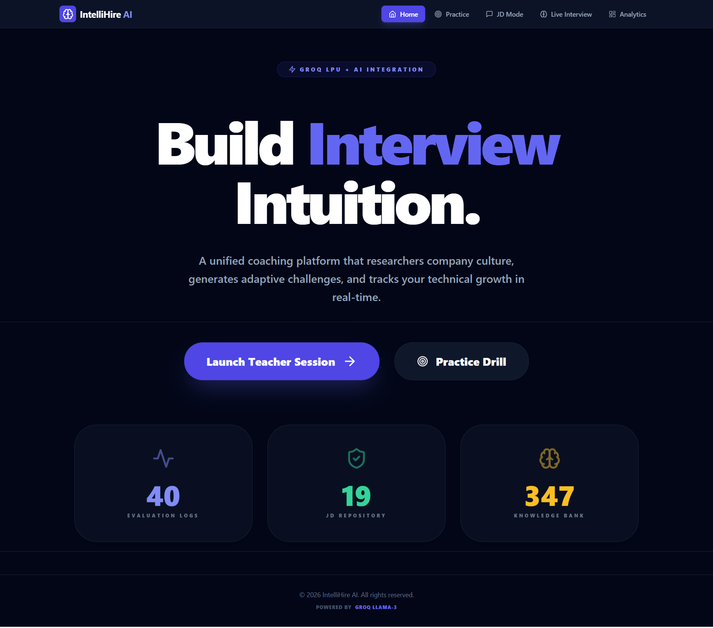
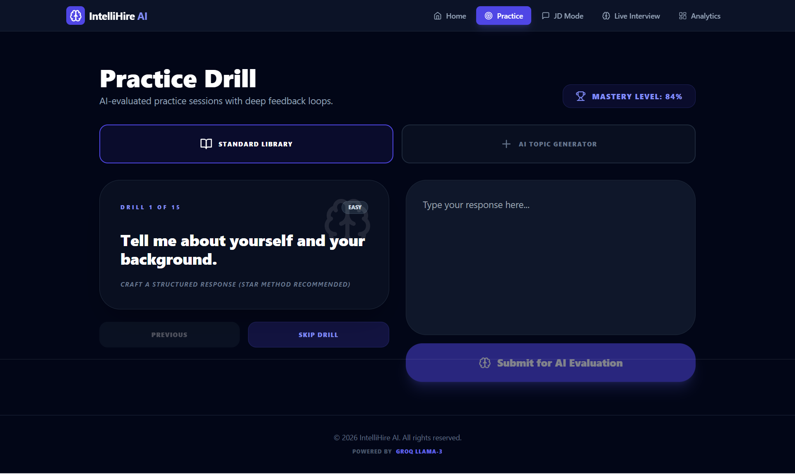
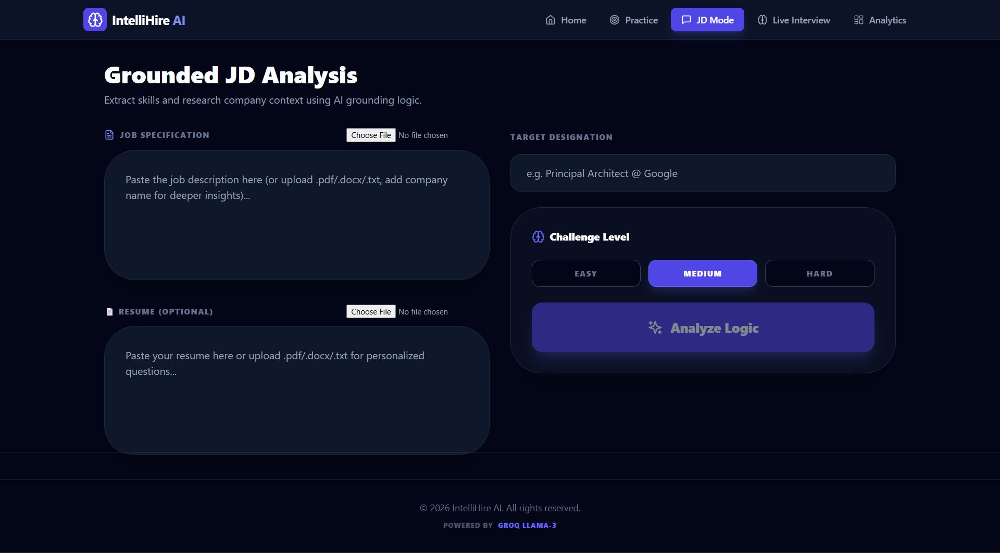
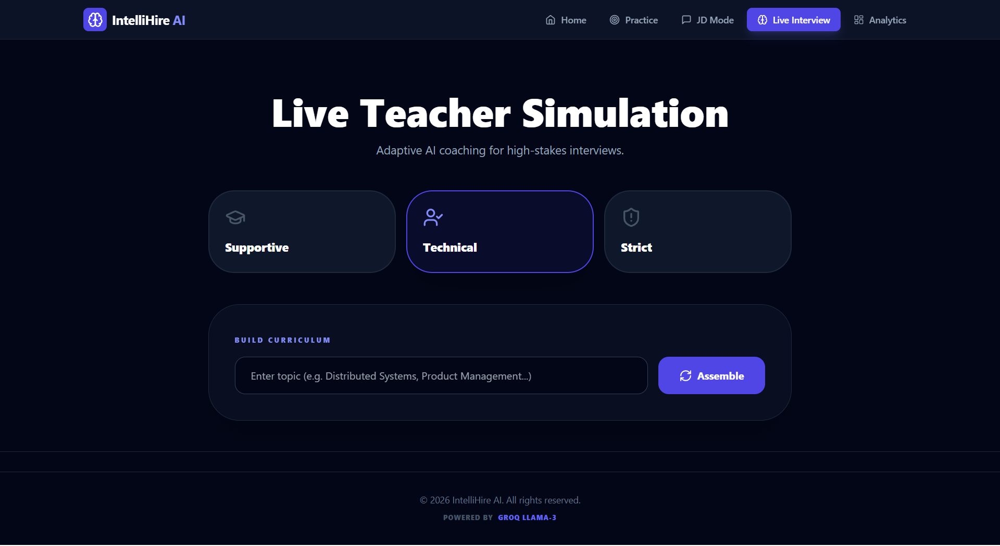
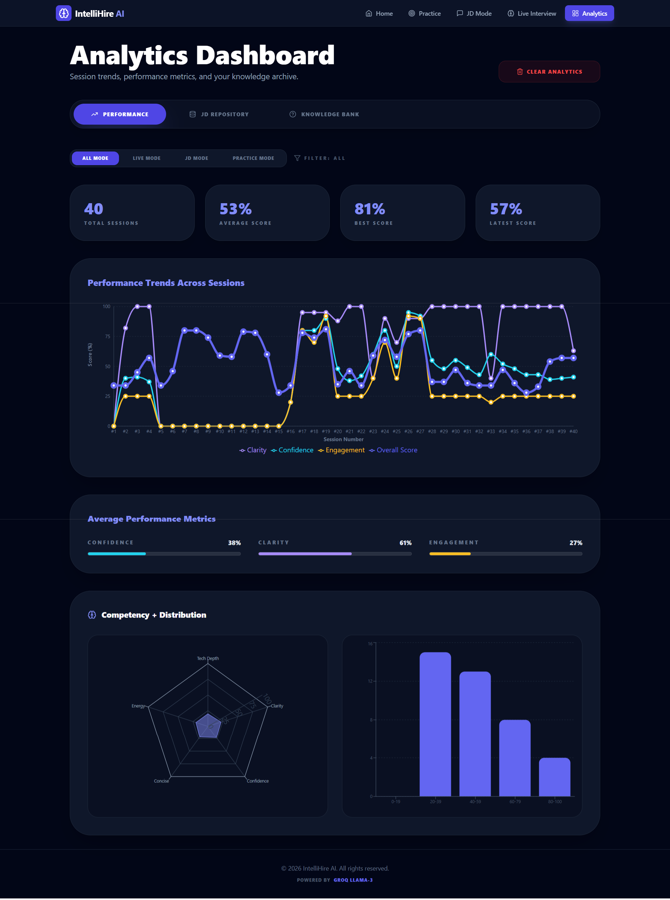

# IntelliHire-AI-Powered-Virtual-Interviewer


IntelliHire is a full-stack AI interview coaching system that combines role-specific question generation, deterministic content analysis, and multimodal behavioral signals to deliver structured interview feedback.

It solves the common problem of generic mock interview tools by grounding questions in job descriptions, storing session artifacts in MongoDB, and enabling reproducible analytics across sessions.

## Table of Contents

- [Features](#features)
- [Project Structure](#project-structure)
- [Installation Instructions](#installation-instructions)
- [Configuration](#configuration)
- [Usage Examples](#usage-examples)
- [Visuals](#visuals)
- [Documentation](#documentation)
- [Known Issues](#known-issues)
- [Roadmap](#roadmap)
- [Contributing](#contributing)
- [License](#license)
- [Author and Contact](#author-and-contact)

## Features

- Three interview modes: Practice, JD Mode, Live Interview
- JD-grounded question generation and metadata extraction
- Deterministic content scoring (keyword relevance, STAR, coherence, vocabulary)
- Structured session persistence in MongoDB
- Analytics dashboard with trends and score summaries
- Python analytics scripts for reproducible paper statistics
- Backend test scripts for flow validation

## Project Structure

- `backend/` - Node.js/Express API, MongoDB models, processing services
- `frontend/` - React/Vite web app and analytics UI
- `analyzer/` - Python analysis scripts and dataset exports
- `paper draft/` - manuscript assets

## Installation Instructions

### 1) Clone and install backend

```bash
cd backend
npm install
```

### 2) Configure backend environment

Create `backend/.env`:

```env
PORT=5000
MONGODB_URI=mongodb://localhost:27017/intellihire
FRONTEND_URL=http://localhost:5173
GROQ_API_KEY=your_groq_api_key
```

### 3) Install and run frontend

```bash
cd ../frontend
npm install
```

Create `frontend/.env`:

```env
VITE_API_BASE_URL=http://localhost:5000/api
```

### 4) Install analyzer dependencies

```bash
cd ../analyzer
pip install -r requirements.txt
```

### 5) Start services

Backend:

```bash
cd ../backend
npm run dev
```

Frontend:

```bash
cd ../frontend
npm run dev
```

## Configuration

- MongoDB database name expected by scripts: `intellihire`
- Main collection used by analyzer: `interviewresults`
- Backend API base URL for frontend: `VITE_API_BASE_URL`
- CORS origin in backend must match frontend URL

## Usage Examples

### Run full app locally

```bash
# terminal 1
cd backend
npm run dev

# terminal 2
cd frontend
npm run dev
```

### Run backend test scripts

```bash
cd backend
node test-all-phase.js
node test-python-integration.js
```

### Run IEEE statistics analysis

```bash
cd analyzer
python IEEEsession_analysis.py
```

Expected output includes:

- total sessions and date range
- mean/std/95 percent CI
- source/role/difficulty breakdowns
- JD traceability counts
- deterministic content and competency summaries

## Visuals








## Documentation

- Backend tests: [backend/TEST_FILES_README.md](/D:/harshita/university/major-project/code/intellihirev17/intellihirev17/backend/TEST_FILES_README.md)
- Analyzer usage: [analyzer/README.md](/D:/harshita/university/major-project/code/intellihirev17/intellihirev17/analyzer/README.md)
- Frontend usage: [frontend/README.md](/D:/harshita/university/major-project/code/intellihirev17/intellihirev17/frontend/README.md)

## Roadmap

- Enforce canonical session submission path for all modes
- Strict JD and question traceability checks for JD-linked sessions
- Move all LLM evaluation to backend with schema validation
- Add role-based access and audit logs
- Improve analytics mobile responsiveness

## Contributing

1. Fork the repository.
2. Create a feature branch.
3. Keep changes scoped and testable.
4. Open a pull request with clear summary and test steps.

## License

No explicit `LICENSE` file is currently included. Until added, treat this project as all rights reserved by the authors.

## Author and Contact

- Harshita Maurya - harshita20maurya@gmail.com
- Sharmili Pednekar - shamipednekar08@gmail.com
- Sannidhi Shetty - sannidhii.1609@gmail.com
- Prof. Sushant Gawade - sushant.gawade1@universal.edu.in
